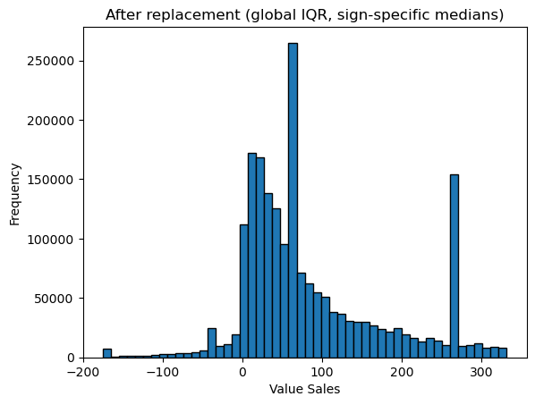
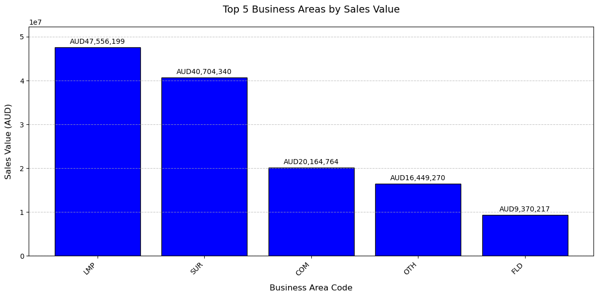
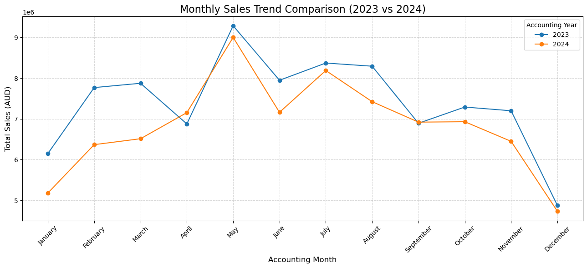
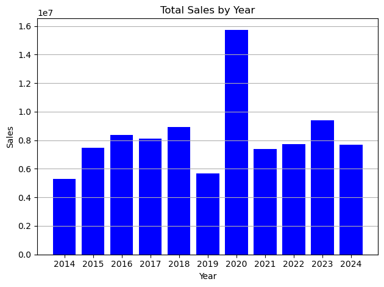
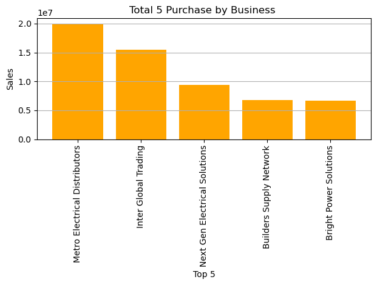
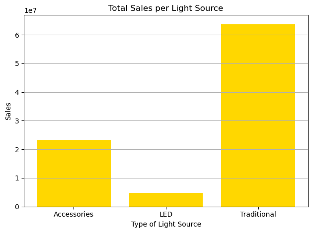

# B2B Lighting Sales Analytics (Python)

Two analyses of sales data from an Australian B2B lighting distributor, anonymised as "LuminaTech". One is a team project on ~2 million transactions. The other is my individual analysis of 10 years of sales history. Both cover data cleaning, exploratory analysis, statistical testing and turning results into management insights.

**Tools:** Python (pandas, NumPy, Matplotlib, Seaborn, SciPy, statsmodels) · Jupyter

---

## 1. Team project: cleaning and statistical analysis

`notebooks/team_sales_statistical_analysis.ipynb`, a team of six. **My role: data cleaning lead**, plus reviewing the statistical tests and regression model.

**The data:** ~2 million transactions across 36 columns, merged from two years of source files (~850 MB).

**Data cleaning (my main contribution)**

- Filled missing values in key fields (sales value, cost, quantity, price adjustment) using **group-based medians** by item type and item class, so the filled values kept the variability of the real data.
- Treated outliers with **IQR-based median replacement**, and checked skewness before and after.
- Filled missing codes (company, currency, warehouse, item class and others) by looking them up from the same order or invoice.
- Fixed invalid dates, such as a 29 February in a non-leap year, standardised text codes, and dropped a column with no useful information.

**Analysis and findings**

| Question | Test | Result | Management insight |
|---|---|---|---|
| Are sales higher in the EOFY months (Apr–Jun)? | Two-sample t-test | No significant difference (t = −0.98, p = 0.33) | Engage clients year-round rather than relying on EOFY campaigns |
| Do Urban Amenity and Industrial products sell differently? | Two-sample t-test | Significant difference (t = 14.7, p < 0.001) | Put more product and sales effort into the stronger segment |
| Do the top 5 and bottom 5 business areas differ? | Two-sample t-test | Significant difference | Review why the bottom areas underperform, and consider reallocating resources |
| What drives profit per transaction? | Multiple linear regression (66 predictors, VIF checked) | Price adjustment is the strongest predictor (coefficient −75, p < 0.001). R² = 0.15 | Watch price adjustments closely, since they cut into profit |

---

## 2. Individual project: 10-year sales performance

`notebooks/individual_sales_visualisation.ipynb`, my own work.

**Cleaning:** converted types, filled missing sales values with medians by item type, corrected invalid years and months (for example, 2027 → 2017 and month 22 → 12), and removed duplicates.

**Findings**

- **Sales were stable from 2014 to 2019, then spiked in 2020** to nearly $16M, almost double the usual level. The spike likely reflects the pandemic, and sales settled back to about $8M a year afterwards.
- **A few key accounts drive most revenue.** The top customer bought nearly $20M over 10 years. That is a partnership opportunity, but also a dependency risk.
- **Traditional lighting still dominates** (over $60M) despite the market shift to LED (about $5M). That points to a window to prepare for the LED transition.

---

## Data

The raw datasets are not included. They are large and were provided for coursework. The notebooks show every cleaning and analysis step.

---

*Nouviboth Ra · [LinkedIn](https://www.linkedin.com/in/nouviboth-ra-792439362)*
